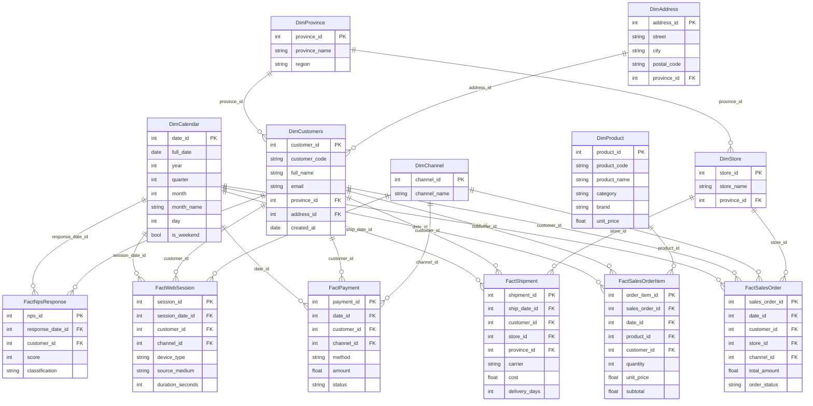

# ♻️ EcoBottle AR – Data Warehouse & BI Dashboard

## 📊 Descripción general

**EcoBottle AR** es un proyecto académico de **Data Warehouse & Business Intelligence** que implementa un mini–ecosistema de datos comercial **(online + offline)** para una empresa ficticia dedicada a la venta de botellas reutilizables.

El objetivo principal es diseñar e implementar un **pipeline ETL reproducible en Python**, construir un **modelo estrella (Kimball)** en **SQLite**, y desarrollar un **dashboard analítico en Looker Studio** que permita monitorear los indicadores clave del negocio.

El proyecto integra múltiples fuentes de información (ventas, pagos, envíos, sesiones web y encuestas NPS) para generar una vista consolidada del desempeño comercial y de la experiencia del cliente.  

Este repositorio contiene el código, los datos y la documentación necesaria para reproducir todo el flujo, desde la extracción de archivos CSV hasta la visualización final de métricas y KPIs.

---

## 🧱 Estructura del proyecto

El repositorio sigue una arquitectura modular de tipo **Data Warehouse Pipeline**, organizada por etapas y responsabilidades, para facilitar la trazabilidad, mantenimiento y escalabilidad del flujo de datos.

```text
EcoBottle-AR/
│
├── assets/             → Recursos gráficos (diagramas, capturas, íconos)
│
├── docs/               → Documentación técnica
│   └── data_dictionary.md
│
├── etl/                → Scripts del proceso ETL (Extract, Transform, Load)
│   ├── config/         → Parámetros, rutas y variables globales
│   ├── extract/        → Lectura de fuentes RAW (.csv)
│   ├── transform/      → Limpieza, joins y creación de dimensiones/hechos
│   ├── load/           → Carga al Data Warehouse (SQLite)
│   ├── quality/        → Validaciones y controles de integridad
│   ├── __init__.py
│   └── run_pipeline.py → Script principal del pipeline
│
├── raw/                → Archivos fuente (.csv) del ecosistema de datos
│
├── warehouse/          → Resultado final del ETL
│   ├── dim/            → Tablas de dimensiones transformadas
│   ├── fact/           → Tablas de hechos transformadas
│
├── requirements.txt    → Dependencias del entorno Python
├── LICENSE             → Licencia del proyecto (MIT)
└── README.md           → Documentación principal del repositorio
```
---

## 🌟 Modelo de Datos

El proyecto se estructura en dos niveles de modelado complementarios:

### 🔹 Modelo Entidad–Relación (DER)
Representa el **modelo lógico original** de las fuentes de datos operacionales, con todas las entidades del ecosistema comercial (clientes, pedidos, productos, pagos, envíos, sesiones, etc.).  
Este modelo fue el punto de partida para comprender las relaciones entre las tablas y definir las claves de negocio.


> *El diagrama DER muestra las entidades base y sus relaciones antes de la transformación hacia el modelo dimensional.*

---

### 🔹 Modelo Estrella (Data Warehouse)
A partir del DER, se construyó el **modelo dimensional** siguiendo la metodología de **Ralph Kimball**, diseñado para optimizar la consulta analítica y la agregación de métricas.

El **esquema estrella** consolida los procesos clave del negocio en varias *fact tables*, conectadas a dimensiones comunes como tiempo, cliente, producto, tienda y canal.

**Hechos principales:**
- `FactSalesOrderItem` – detalle de ventas por producto y fecha.  
- `FactPayment` – pagos realizados por cliente.  
- `FactShipment` – envíos procesados y costos asociados.  
- `FactWebSession` – sesiones web de usuarios.  
- `FactNpsResponse` – respuestas de encuestas de satisfacción (NPS).

**Dimensiones comunes:**
- `DimCalendar`, `DimCustomer`, `DimProduct`, `DimStore`, `DimChannel`, `DimProvince`, `DimAddress`, entre otras.

### 🧩 Diagrama del Modelo Estrella
El siguiente diagrama, generado con **Mermaid**, representa la estructura final del Data Warehouse, donde las tablas de hechos se conectan con sus respectivas dimensiones:



## ⚙️ Pipeline ETL

El proceso ETL de **EcoBottle AR** automatiza la creación del Data Warehouse a partir de los archivos fuente en formato `.csv`.  
Está desarrollado en **Python** y estructurado en módulos independientes que reflejan las tres fases clásicas del pipeline: **Extract**, **Transform** y **Load**.

### 1️⃣ Extract
En esta etapa se realiza la **lectura de las fuentes RAW** desde la carpeta `/raw`, aplicando validaciones básicas de formato y consistencia (por ejemplo: columnas esperadas, tipos de datos, duplicados y valores nulos críticos).  

Los datos se cargan en estructuras temporales de `pandas.DataFrame` listas para ser transformadas.

```bash
python -m etl.extract
```

### 2️⃣ Transform
Aquí se lleva a cabo la limpieza, estandarización e integración de todas las tablas.
Se generan las claves sustitutas (surrogate keys), se aplican normalizaciones de texto y se unifican los dominios de provincias, canales, productos y fechas.
También se construyen las tablas de dimensiones y hechos a partir de las relaciones del modelo DER.
```bash
python -m etl.transform 
```
Principales transformaciones:
- Conversión de tipos y manejo de nulos
- Creación de claves primarias y foráneas
- Join entre pedidos, clientes, productos, canales y envíos
- Cálculo de métricas derivadas (monto, cantidad, ticket promedio, etc.)
- Normalización de fechas en una DimCalendar reutilizable

### 3️⃣ Load
Los datos finales se cargan en la carpeta /warehouse, generando una base SQLite con la estructura del modelo estrella (star_schema.sql).
El proceso asegura la integridad referencial entre dimensiones y hechos, y deja el dataset listo para conectarse a Looker Studio o cualquier herramienta BI.
```bash
python -m etl.load
```

### ▶️ Ejecución completa del pipeline
Ejecuta los tres pasos anteriores en secuencia, registrando logs del proceso:
```bash
python -m etl.run_pipeline
```

> *Este script orquesta todas las fases del ETL en orden secuencial y deja registrada la trazabilidad en consola (logging).*

## 📘 Diccionario de Datos

El **diccionario de datos** documenta los campos, claves y dominios del modelo de datos, sirviendo como referencia para el mantenimiento y análisis del Data Warehouse.

Incluye:
- Descripción funcional de cada tabla (dimensión o hecho).  
- Significado de cada campo y su unidad de medida.  
- Identificación de **claves primarias (PK)** y **foráneas (FK)**.  
- Dominios válidos y valores controlados (por ejemplo: provincias, canales, categorías).  
- Supuestos de negocio aplicados durante la transformación (por ejemplo: asignación de provincias faltantes, codificación de fechas, categorización de productos).

El documento completo se encuentra en:

📄 [`docs/data_dictionary.md`](docs/data_dictionary.md)

> *Este archivo centraliza toda la metadata del modelo estrella y sirve como insumo técnico para futuras integraciones o validaciones de calidad.*

El **diccionario** complementa al **DER original** y al **modelo estrella**, asegurando la trazabilidad entre el origen (archivos CSV) y las estructuras finales del Data Warehouse.

## 📊 KPIs Principales

El modelo estrella permite calcular y analizar indicadores clave del negocio, combinando información de ventas, pagos, envíos, sesiones web y encuestas NPS.

Los siguientes **KPIs** se utilizan en el dashboard analítico para evaluar el rendimiento comercial y la satisfacción del cliente:

| KPI | Fórmula / Fuente | Descripción |
|-----|------------------|--------------|
| **Ventas Totales** | `SUM(amount)` en `FactSalesOrderItem` | Valor total vendido en un período. |
| **Usuarios Activos** | `COUNT(DISTINCT customer_id)` | Número de clientes que realizaron al menos una compra. |
| **Ticket Promedio** | `SUM(amount) / COUNT(DISTINCT sales_order_id)` | Valor promedio por pedido. |
| **Pagos Aprobados** | `COUNT(payment_id WHERE status = 'Aprobado')` | Transacciones de pago exitosas. |
| **Costo de Envíos** | `SUM(cost)` en `FactShipment` | Gasto total asociado a entregas. |
| **NPS (Net Promoter Score)** | %Promotores − %Detractores | Nivel de satisfacción y lealtad del cliente. |
| **Duración Promedio de Sesiones** | `AVG(duration_seconds)` en `FactWebSession` | Tiempo promedio que un usuario permanece en la web. |

> *Estos indicadores se visualizan en el dashboard Looker Studio para monitorear tendencias de ventas, desempeño logístico y comportamiento del cliente.*

---

**Fuentes de datos:**
- `FactSalesOrderItem` → Ventas y cantidades.  
- `FactPayment` → Métodos y estado de pagos.  
- `FactShipment` → Costos y tiempos de entrega.  
- `FactWebSession` → Actividad online.  
- `FactNpsResponse` → Satisfacción del cliente.  

---

## 📈 Dashboard Analítico

A partir del modelo estrella almacenado en `warehouse/`, se desarrolló un **dashboard interactivo** en **Looker Studio**, que consolida los KPIs del negocio y permite explorar los datos desde distintas perspectivas: comercial, logística, digital y de experiencia del cliente.

El tablero integra información de todas las *fact tables* (ventas, pagos, envíos, sesiones y NPS) y ofrece una visión unificada del desempeño general de **EcoBottle AR**.

### 🎯 Objetivo
Brindar una herramienta de análisis que permita:
- Monitorear el cumplimiento de objetivos comerciales.
- Analizar el comportamiento de clientes y productos.
- Identificar patrones de compra y eficiencia logística.
- Evaluar la satisfacción del cliente mediante NPS.

### 🧭 Principales vistas
- **Ventas por provincia y canal**  
- **Ranking mensual de productos**  
- **Evolución del ticket promedio y volumen de ventas**  
- **Tiempos y costos de envío por zona**  
- **Actividad de usuarios en canales online**  
- **Distribución de NPS (Promotores / Neutros / Detractores)**  

---

📊 **Herramienta:** [Google Looker Studio](https://lookerstudio.google.com/)  
📷 *Captura del dashboard final (opcional):*  


---

## 🧾 Licencia y reconocimiento

Este proyecto fue desarrollado por **Bernardo Di Rienzo** en el marco de la Licenciatura en Ciencia de Datos de la Universidad Austral (2025).

Los archivos originales de datos (`/raw`) y el diagrama entidad–relación (`DER`) provienen del repositorio académico base del profesor **Augusto Carmona**, utilizados únicamente como punto de partida para la práctica de modelado y análisis.

> © 2025 Bernardo Di Rienzo – MIT License. Todos los derechos reservados sobre los desarrollos y documentación propios.

